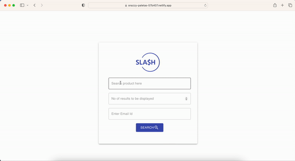
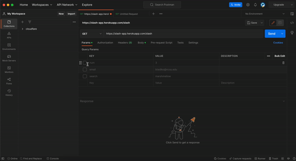

<p align="center"></p>

**Shopping Made Easy**


 
[](https://zenodo.org/badge/latestdoi/568663442)


[](https://github.com/vamsitadikonda/slash/releases/)

[](https://codecov.io/gh/vamsitadikonda/slash)
[](https://github.com/vamsitadikonda/slash)
[](https://github.com/vamsitadikonda/slash/network/members)
[](https://github.com/vamsitadikonda/slash/actions)
[](https://app.netlify.com/sites/snazzy-paletas-57b407/deploys)


Slash is a command line tool that scrapes the most popular e-commerce websites to get the best deals on the searched items across these websites. 
- **Fast**: With slash, you can save over 50% of your time by comparing deals across websites within seconds
- **Easy**: Slash uses very easy commands to filter, sort and search your items
- **Powerful**: Quickly alter the commands to get desired results
- **Informative**: Provides the information about items through an email with attached csv file

<ul align="left">
  <li> <a href="#iphone-our-products">Our Products</a> </li>

  <li> <a href="#rocket-new-improvements">New Improvements</a> </li>

  <li> <a href="#chart_with_upwards_trend-benchmarks-and-scalability">Benchmarks & Scalability</a> </li>

  <li> <a href="#wrench-installation">Installation</a> </li>
  
  <li> <a href="#golf-flags-and-command-line-arguments">Flags & Args</a> </li>
  
  <li><a href="#card_index_dividers-some-examples">Examples</a></li>
  
  <li><a href="#thought_balloon-use-case">Use Case</a></li>
  
  <li><a href="#page_facing_up-why">Why</a></li>
  
  <li><a href="#gear-technologies-used">Technologies</a></li>

  <li><a href="#sparkles-contributors">Contributors</a></li>
  
  <li><a href="#email-support">Support</a></li>
  
</ul>

---
:iphone: Our Products
---
### Slash Website
<p align="center"></p>

### Slash REST API 

<p align="center"></p>

### Slash CLI Tool
<p align="center"></p>


:rocket: New Improvements
---
The latest version of Slash has a lot of new Improvements. 

1. For Starters, We have designed a new website which can be easily accessed by anyone.
2. We have released a REST API version of the Slash which can be used by anyone to plugin the results to their applications. 
3. The Application is now **13 times faster** than the previous version (more info at SCALABILITY.md). The improvements have been possible by optimizing the webscraping process using multithreading and shifting to a faster HTML parser. 
The improvements have been made across all the products (Website, REST Api, CLI Tool).
4. The REST API can be accessed using ```https://slash-app.herokuapp.com/slash```
5. The Slash Website can be accessed from ```https://tinyurl.com/slash-app```

:chart_with_upwards_trend:  Benchmarks and Scalability
---
Our code optimizations and benchmark results while developing the application are mentioned in [SCALABILITY.md](./SCALABILITY.md)  


:wrench: Installation
---
A detailed description of how to install the software is shown [INSTALL.md](./INSTALL.md)


:golf: Flags and Command Line Arguments
---
Currently the tool supports the following flags and command line arguments. These flags and arguments can be used to quickly filter and guide the search to get you the best results very quickly.

| Arguments | Type | Default | Description                                                          |
|-----------|------|---------|----------------------------------------------------------------------|
| --search  | str  | None    | The product name to be used as the search query                      |
| --num     | int  | 3       | Maximum number of products to search                                 |
| --sort    | str  | re      | Sort results by relevance (re), by price (pr), by rating (ra) or by all the features using "all" this sorts in the order of price and ratings in the respective order|
| --des     | bool | True      | Set boolean flag if results should be sorted in non-increasing order, the default value is true |
| --email   | str  | "" (empty string) | list of comma separated emails to send notifications |

:card_index_dividers: Some Examples
---
Detailed Examples along with videos have been documented at [EXAMPLES.md](./EXAMPLES.md)

:thought_balloon: Use Case
---
* ***Students***: Students coming to university are generally on a budget and time constraint and generally spend hours wasting time to search for products on Websites. Slash is the perfect tool for these students that slashes all the unnecessary details on a website and helps them get prices for a product across multiple websites.Make the most of this tool in the upcoming Black Friday Sale.
* ***Data Analysts***: Finding data for any project is one of the most tedious job for a data analyst, and the datasets found might not be the most recent one. Using slash, they can create their own dataset in real time and format it as per their needs so that they can focus on what is actually inportant.
* ***Customers***: Can be used by customers to simply query for the items and get a email on the details.

:page_facing_up: Why
---
- In a market where we are spoilt for choices, we often look for the best deals.  
- The ubiquity of internet access has leveled the retail playing field, making it easy for individuals and businesses to sell products without geographic limitation. In 2020, U.S. e-commerce sales, receiving a boost due to the COVID-19 pandemic, grew 44% and represented more than 21% of total retail sales, according to e-commerce information source Internet Retailer.
- The growth of e-commerce has not only changed the way customers shop, but also their expectations of how brands approach customer service, personalize communications, and provide customers choices.
- E-commerce market has prompted cut throat competition amongst dealers, which is discernable through the price patterns for products of major market players. Price cuts are somewhat of a norm now and getting the best deal for your money can sometimes be a hassle (even while online shopping).
- This is what Slash aims to reduce by giving you an easy to use, all in one place solution for finding the best deals for your products that major market dealers have to offer!
- Slash in its current form is for people who have some understanding of python and are comfortable in using the command line interface to interact with systems.
- Future updates aim to encompass a wide variety of users irrespective of their computer knowledge and background.

:open_file_folder: Document Generated
---
To have a better understanding of the code, please click on the [link](https://www.vamsitadikonda.com/slash/) provided below.

[Github Pages](https://www.vamsitadikonda.com/slash/)


:gear: Technologies used
---
 Python </br>
 React </br>
 Flask </br>
 Heroku </br>
 Netlify </br>


## Directory Structure
``` txt
.github/workflows
assets
docs
src
tests
.coverage
.gitignore 
CODE-OF-CONDUCT.md
CONTRIBUTING.md
EXAMPLES.md
INSTALL.md
LICENSE
Procfile
README.md
SCALABILITY.md  
requirements.txt
setup.py 
```


:sparkles: Contributors
---

<table>
  <tr>
    <td align="center"><a href="https://www.linkedin.com/in/vamsitadikonda">Vamsi Tadikonda</a></td>
    <td align="center"><a href="https://www.linkedin.com/in/swimitha-buchannolla-52114b120">Swimitha Buchannolla</a></td>
    <td align="center"><a href="https://www.linkedin.com/in/vinay-perolla">Vinay Kumar Reddy Perolla</a></td>
    <td align="center"><a href="https://www.linkedin.com/in/bharathkatabathuni">Bharath Katabathuni</a></td>
    <td align="center"><a href="https://www.linkedin.com/in/saisree4">Sai Sree Nalluru</a></td>
  </tr>
</table>

:email: Support
---

For any queries and help, please reach out to us at: vamsitadikonda99@gmail.com
